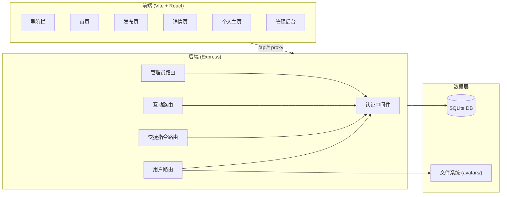
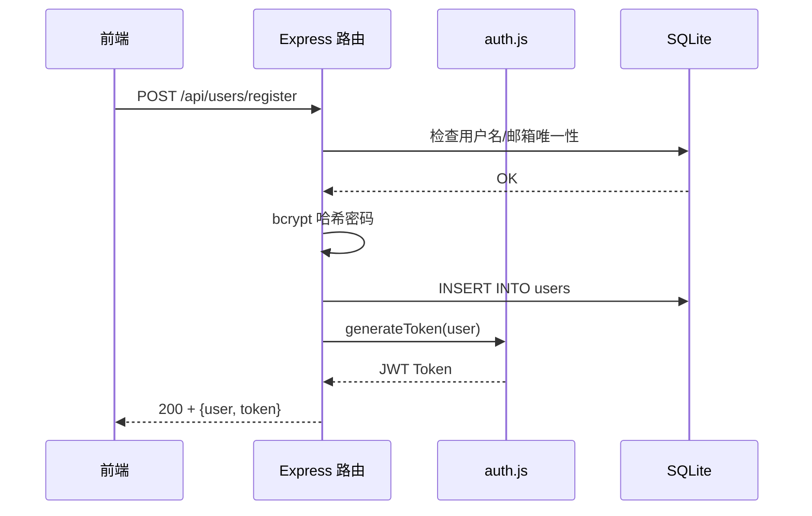
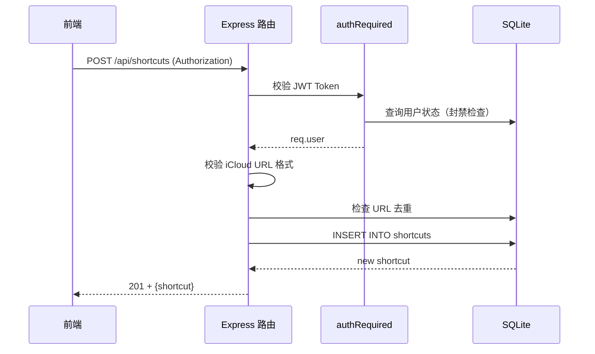
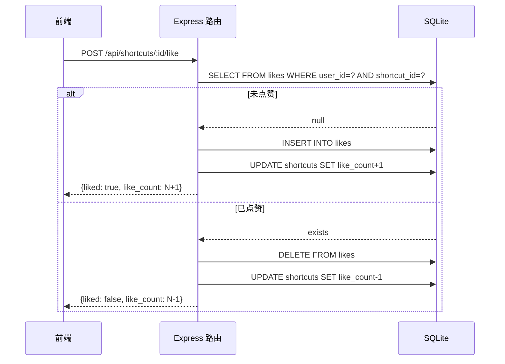

# 系统架构

## 概述

捷径社区是一个面向 iOS 用户的快捷指令（Shortcut）分享平台。用户可以发布 iCloud 快捷指令链接，浏览他人分享的指令，进行点赞和评论互动。系统实现了完整的用户认证（JWT）、角色权限（普通用户/管理员）、内容审核（下架/恢复）、封禁管理和软删除机制。

系统采用经典的前后端分离架构：React 前端通过 Vite 反向代理与 Express 后端通信，后端使用 SQLite 作为持久化存储。生产模式下后端同时托管前端静态资源，支持 SPA 路由。

## 技术栈

**语言与运行时**
- TypeScript 6.x（前端）
- JavaScript（后端，Node.js）

**前端框架**
- React 19.x + react-router-dom v6
- Vite 8.x（构建工具）
- Tailwind CSS 4.x（样式）

**后端框架**
- Express 4.21
- better-sqlite3（同步 SQLite 驱动）

**认证与安全**
- jsonwebtoken（JWT HS256）
- bcryptjs（密码哈希）
- multer（文件上传）

**数据存储**
- SQLite（单文件数据库 `data/shortcuts.db`）
- 本地文件系统（头像上传）

**基础设施**
- 无容器化配置（直接 Node.js 进程运行）
- 无 CI/CD 配置

## 项目结构

```
workspace/
├── backend/                         # 后端
│   ├── package.json
│   ├── src/
│   │   ├── index.js                 # Express 应用入口，路由装配
│   │   ├── auth.js                  # JWT 认证中间件（3 级权限）
│   │   ├── database.js              # SQLite Schema 和数据迁移
│   │   └── routes/
│   │       ├── user.js              # 用户路由（注册/登录/资料/头像）
│   │       ├── shortcut.js          # 快捷指令路由（CRUD/列表/下架/恢复）
│   │       ├── interact.js          # 互动路由（点赞/评论）
│   │       └── admin.js             # 管理员路由（用户管理/分享管理）
│   └── uploads/
│       └── avatars/                 # 头像上传存储目录
├── frontend/                        # 前端
│   ├── package.json
│   ├── vite.config.ts               # Vite + 反向代理配置
│   ├── tsconfig.json
│   ├── index.html
│   ├── public/
│   │   └── logo.png                 # Logo 图片
│   └── src/
│       ├── main.tsx                 # React 入口
│       ├── App.tsx                  # 根组件（路由+布局）
│       ├── api.ts                   # API 调用封装
│       ├── AuthContext.tsx          # 认证上下文（状态管理）
│       ├── index.css                # Tailwind CSS 入口
│       ├── components/
│       │   ├── Navbar.tsx           # 顶部导航栏
│       │   └── Footer.tsx           # 底部页脚
│       └── pages/
│           ├── types.ts             # 共享 TypeScript 类型
│           ├── Home.tsx             # 首页（快捷指令列表）
│           ├── Login.tsx            # 登录页
│           ├── Register.tsx         # 注册页
│           ├── ShortcutDetail.tsx   # 快捷指令详情页
│           ├── Share.tsx            # 发布快捷指令页
│           ├── UserProfile.tsx      # 用户主页
│           └── Admin.tsx            # 管理后台
└── .monkeycode/
    └── docs/                        # 项目文档（本目录）
```

**入口点**
- `backend/src/index.js` - 后端应用启动
- `frontend/src/main.tsx` - 前端应用挂载
- `frontend/src/App.tsx` - 路由定义和布局

## 子系统

### 认证子系统 (Auth)
**目的**: JWT 身份认证、权限控制、封禁判断
**位置**: `backend/src/auth.js`, `frontend/src/AuthContext.tsx`
**关键文件**: `auth.js`, `AuthContext.tsx`
**依赖**: bcryptjs, jsonwebtoken, SQLite users 表
**被依赖**: 所有路由、前端页面

### 用户子系统 (User)
**目的**: 用户注册、登录、资料管理、头像上传
**位置**: `backend/src/routes/user.js`, `frontend/src/pages/Login.tsx`, `Register.tsx`, `UserProfile.tsx`
**关键文件**: `user.js`, `UserProfile.tsx`
**依赖**: auth.js (JWT 签发/校验), multer (头像上传)
**被依赖**: 首页、详情页（展示用户信息）

### 快捷指令子系统 (Shortcut)
**目的**: 快捷指令的发布、浏览、编辑、下架/恢复、下载重定向
**位置**: `backend/src/routes/shortcut.js`, `frontend/src/pages/Home.tsx`, `Share.tsx`, `ShortcutDetail.tsx`
**关键文件**: `shortcut.js`, `Share.tsx`, `ShortcutDetail.tsx`
**依赖**: auth.js (创建/编辑/删除需认证), SQLite shortcuts 表
**被依赖**: 互动子系统（点赞和评论）

### 互动子系统 (Interaction)
**目的**: 点赞（toggle 模式）和评论功能
**位置**: `backend/src/routes/interact.js`
**关键文件**: `interact.js`
**依赖**: auth.js (需认证), SQLite likes/comments 表
**被依赖**: 首页、详情页（展示点赞和评论数据）

### 管理子系统 (Admin)
**目的**: 用户封禁/解封、分享管理、内容审核
**位置**: `backend/src/routes/admin.js`, `frontend/src/pages/Admin.tsx`
**关键文件**: `admin.js`, `Admin.tsx`
**依赖**: auth.js (adminRequired 中间件)
**被依赖**: 无

## 架构图



## 数据流

### 用户注册/登录流程



### 发布快捷指令流程



### 点赞 Toggle 流程



## 设计决策

1. **SQLite 而非 PostgreSQL/MySQL** -- 社区规模小，单文件数据库降低运维复杂度，better-sqlite3 同步 API 简化异步错误处理
2. **软删除而非硬删除** -- 快捷指令使用 `status` 字段标记下架，支持恢复，避免数据丢失
3. **纯链接分享，无文件上传** -- 快捷指令的实质内容是 iCloud 链接，服务器不存储指令文件，下载时 302 重定向至 iCloud
4. **手动维护计数** -- `like_count` 和 `comment_count` 在 shortcuts 表中手动维护而非查询计算，提升列表查询性能
5. **前端状态管理使用 React Context** -- 项目规模小，无需 Redux/Zustand 等外部状态库，AuthContext 满足全部认证状态需求
6. **生产模式后端托管前端** -- Express 在检测到 `frontend/dist/` 目录时自动托管静态文件，SPA 路由 fallback，省去 Nginx 部署
