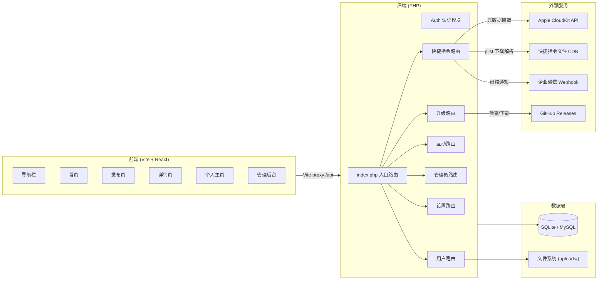
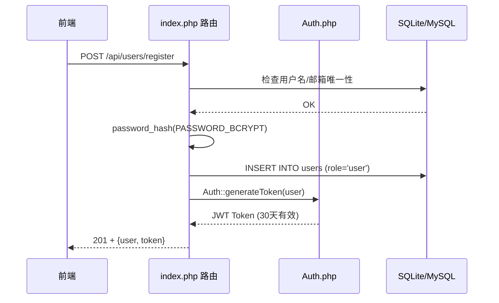
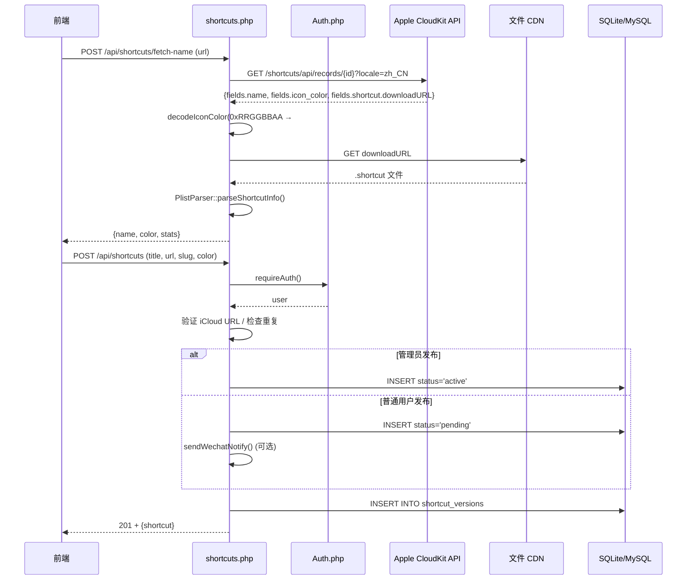
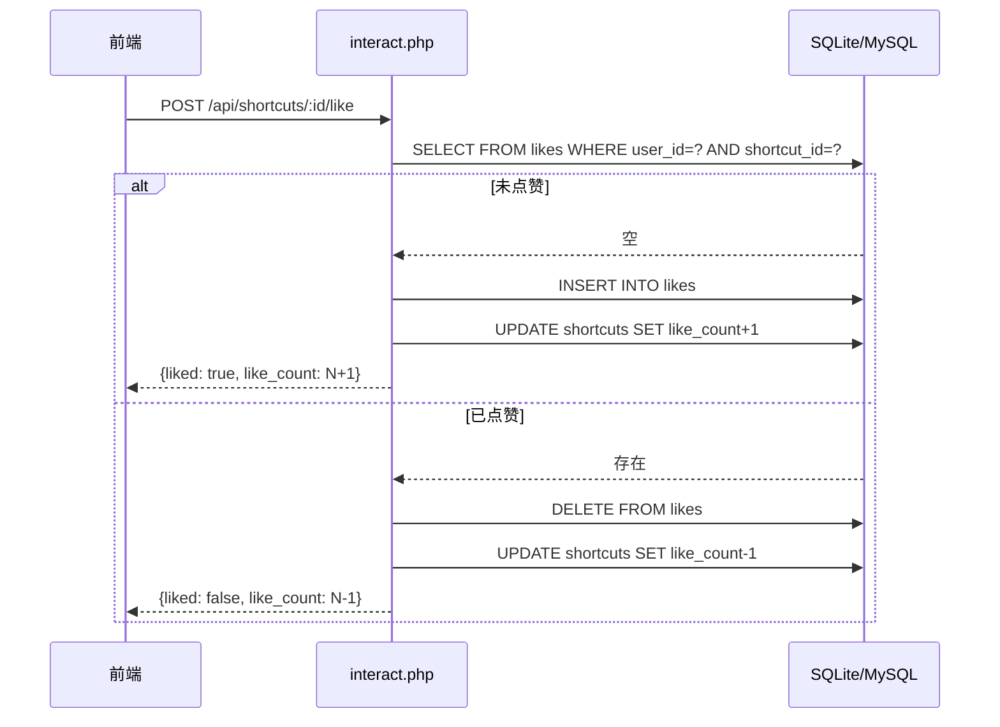

# 系统架构

## 概述

捷径社区是一个面向 iOS 用户的快捷指令（Shortcut）分享平台。用户可以发布 iCloud 快捷指令链接，浏览他人分享的指令，进行点赞和评论互动。系统实现了完整的用户认证（JWT）、三级角色权限（站长 owner / 管理员 admin / 普通用户 user）、内容审核（待审核 pending / 活跃 active / 已下架 removed）、封禁管理、软删除和在线升级机制。

系统采用经典的前后端分离架构：React 前端通过 Vite 反向代理与 PHP 后端通信，后端使用 SQLite/MySQL 双驱动作为持久化存储。生产模式下由 Apache 托管，`public/` 为文档根目录。

后端在发布快捷指令时会主动访问 Apple CloudKit API 抓取指令元数据（真实名称、图标主题色）并下载指令文件解析统计信息（操作步骤数、文件大小、访问权限），展示在详情页。每个快捷指令在发布时分配一个 10 位秒级时间戳 slug，作为固定不变的作品地址标识。

## 技术栈

**后端语言**
- PHP >= 7.4（推荐 8.0+）
- Composer 依赖管理（PSR-4 自动加载，命名空间 `Shortcut`）

**核心依赖**
- `firebase/php-jwt ^6.0` -- JWT HS256 认证
- `rodneyrehm/plist ^2.0` -- iOS 快捷指令 plist 文件解析

**前端框架**
- React 19.x + react-router-dom v6
- Vite 8.x（构建工具）
- Tailwind CSS 4.x（样式）

**数据存储**
- SQLite（默认，零配置单文件 `data/database.sqlite`）
- MySQL（可选，设置 `DB_DRIVER=mysql` 切换，InnoDB + utf8mb4）
- 本地文件系统（头像上传 `uploads/`）

**基础设施**
- Apache + .htaccess URL 重写（生产）
- PHP 内置开发服务器（开发）
- GitHub Releases API 在线升级

## 项目结构

```
workspace/
├── php-shortcut/                    # PHP 后端
│   ├── .env                         # 环境变量（JWT_SECRET, DB_DRIVER 等）
│   ├── .htaccess                    # 生产环境 Apache URL 重写
│   ├── VERSION                      # 当前版本号（如 1.3.2）
│   ├── composer.json                # Composer 依赖 + PSR-4 自动加载
│   ├── data/                        # SQLite 数据库文件（运行时创建）
│   ├── uploads/                     # 用户头像上传
│   ├── vendor/                      # Composer 依赖包
│   ├── public/
│   │   ├── .htaccess                # Apache 重写规则
│   │   ├── index.php                # 入口点（路由分发 + .env 加载 + CORS）
│   │   └── install.php              # Web 安装引导（检查/建表/创建站长）
│   └── src/
│       ├── Auth.php                 # JWT 认证类（三级角色）
│       ├── Database.php             # PDO 封装（SQLite/MySQL 双驱动）
│       ├── PlistParser.php          # 快捷指令 .shortcut 文件解析器
│       ├── Response.php             # JSON 响应辅助类
│       └── routes/
│           ├── users.php            # 用户路由（注册/登录/资料/头像）
│           ├── shortcuts.php        # 快捷指令路由（CRUD/元数据抓取/统计/版本）
│           ├── interact.php         # 互动路由（点赞/评论）
│           ├── admin.php            # 管理员路由（仪表盘/用户/审核/快捷指令管理）
│           ├── settings.php         # 站点设置（公开/管理员读写 + 企微 webhook）
│           └── update.php           # 在线升级（检查/下载/安装 + 版本端点）
├── frontend/                        # 前端（React + Vite SPA）
│   ├── vite.config.ts               # Vite + 反向代理配置
│   ├── index.html                   # SPA 入口
│   ├── public/
│   │   └── logo.png                 # Logo 图片
│   └── src/
│       ├── main.tsx                 # React 入口
│       ├── App.tsx                  # 根组件（路由+布局+ToastProvider）
│       ├── api.ts                   # API 调用封装
│       ├── AuthContext.tsx          # 认证上下文（状态管理）
│       ├── ToastContext.tsx         # Toast 通知上下文
│       ├── index.css                # Tailwind CSS 入口
│       ├── components/
│       │   ├── Navbar.tsx           # 顶部导航栏
│       │   ├── Footer.tsx           # 底部页脚
│       │   ├── admin/               # 管理后台子组件
│       │   │   ├── SiteSettings.tsx
│       │   │   ├── PendingReview.tsx
│       │   │   ├── UserManagement.tsx
│       │   │   ├── ShortcutManagement.tsx
│       │   │   └── UpdateSystem.tsx
│       │   └── shortcut/            # 快捷指令子组件
│       │       ├── CommentSection.tsx
│       │       ├── VersionPanel.tsx
│       │       ├── ShortcutEditForm.tsx
│       │       └── PermissionIcon.tsx
│       └── pages/
│           ├── types.ts             # 共享 TypeScript 类型 + CATEGORIES 常量
│           ├── Home.tsx             # 首页（快捷指令列表）
│           ├── Login.tsx            # 登录页
│           ├── Register.tsx         # 注册页
│           ├── ShortcutDetail.tsx   # 快捷指令详情页（533 行）
│           ├── Share.tsx            # 发布快捷指令页
│           ├── UserProfile.tsx      # 用户主页
│           └── Admin.tsx            # 管理后台（46 行，tab 路由分发）
└── .monkeycode/
    └── docs/                        # 项目文档（本目录）
```

**入口点**
- `php-shortcut/public/index.php` -- 后端应用启动，所有请求入口
- `php-shortcut/public/install.php` -- Web 安装引导
- `frontend/src/main.tsx` -- 前端应用挂载
- `frontend/src/App.tsx` -- 路由定义和布局

## 子系统

### 认证子系统 (Auth)
**目的**: JWT 身份认证、三级角色控制、封禁判断
**位置**: `php-shortcut/src/Auth.php`, `frontend/src/AuthContext.tsx`
**关键文件**: `Auth.php`, `AuthContext.tsx`
**依赖**: firebase/php-jwt, SQLite/MySQL users 表
**被依赖**: 所有路由、前端页面

关键方法：
- `setSecret()` -- 从 .env 设置 JWT 密钥
- `generateToken()` -- 签发 30 天有效的 HS256 JWT（含 id, username, role）
- `requireAuth()` -- 返回当前用户或 null
- `requireAdmin()` -- 要求角色为 admin 或 owner
- `requireOwner()` -- 要求角色为 owner（仅站长）

### 用户子系统 (User)
**目的**: 用户注册、登录、资料管理、头像上传、登录频率限制
**位置**: `php-shortcut/src/routes/users.php`, `frontend/src/pages/Login.tsx`, `Register.tsx`, `UserProfile.tsx`
**关键文件**: `users.php`, `UserProfile.tsx`
**依赖**: Auth.php (JWT 签发/校验), PHP 文件上传
**被依赖**: 首页、详情页（展示用户信息）

登录频率限制：每 IP 15 分钟内最多 5 次尝试，记录到 `login_attempts` 表。

### 快捷指令子系统 (Shortcut)
**目的**: 快捷指令的发布、浏览、编辑、下架/恢复、下载重定向，以及发布时的元数据抓取（真实名称/主题色）和统计解析（步骤数/大小/权限）
**位置**: `php-shortcut/src/routes/shortcuts.php`, `frontend/src/pages/Home.tsx`, `Share.tsx`, `ShortcutDetail.tsx`
**关键文件**: `shortcuts.php`, `Share.tsx`, `ShortcutDetail.tsx`
**依赖**: Auth.php (创建/编辑/删除需认证), PlistParser.php (统计解析), Apple CloudKit API (元数据抓取)
**被依赖**: 互动子系统（点赞和评论）

发布流程：前端先调 `POST /api/shortcuts/fetch-name` 预取元数据（名称、颜色、统计），再调 `POST /api/shortcuts` 创建记录。管理员发布直接 active，普通用户发布为 pending 待审核。后端 `fetchShortcutMeta()` 调用 iCloud API，`decodeIconColor()` 将 0xRRGGBBAA 转换为 #RRGGBB。

### 互动子系统 (Interaction)
**目的**: 点赞（toggle 模式）和评论功能，支持嵌套回复
**位置**: `php-shortcut/src/routes/interact.php`
**关键文件**: `interact.php`
**依赖**: Auth.php (需认证), SQLite/MySQL likes/comments 表
**被依赖**: 首页、详情页（展示点赞和评论数据）

### 管理子系统 (Admin)
**目的**: 仪表盘、用户管理（新建/角色变更/封禁）、快捷指令管理（搜索/删除）、内容审核（通过/拒绝）
**位置**: `php-shortcut/src/routes/admin.php`, `frontend/src/pages/Admin.tsx` + `components/admin/`
**关键文件**: `admin.php`, `Admin.tsx`
**依赖**: Auth.php (requireAdmin/requireOwner)
**被依赖**: 无

角色权限矩阵：
| 操作 | user | admin | owner |
|------|------|-------|-------|
| 查看仪表盘 | - | 是 | 是 |
| 封禁/解封用户 | - | 是（不可操作 admin/owner） | 是 |
| 审核快捷指令 | - | 是 | 是 |
| 新建用户 | - | - | 是 |
| 变更用户角色 | - | - | 是 |
| 站点设置 | - | - | 是 |
| 系统升级 | - | - | 是 |

### 设置子系统 (Settings)
**目的**: 站点设置 CRUD、企业微信通知配置
**位置**: `php-shortcut/src/routes/settings.php`
**关键文件**: `settings.php`
**依赖**: Auth.php (update 需 owner)
**被依赖**: shortcuts.php（企业微信 webhook 通知）

设置键：`site_name`, `site_logo`, `icp_number`, `seo_title`, `seo_description`, `wechat_bot_token`

### 升级子系统 (Update)
**目的**: 在线检查/执行升级，从 GitHub Releases 下载 zip 部署
**位置**: `php-shortcut/src/routes/update.php`
**关键文件**: `update.php`
**依赖**: Auth.php (需 owner), ZipArchive PHP 扩展
**被依赖**: 无

两阶段升级：stage=download 下载 zip → stage=install 备份关键文件、提取、部署（保留 data/uploads/.env）。

## 架构图



## 数据流

### 用户注册/登录流程



### 发布快捷指令流程



### 点赞 Toggle 流程



## 设计决策

1. **PHP 而非 Node.js** -- 适配宝塔面板 + Apache 共享托管，零服务器进程管理，`public/` 直接作为站点根目录
2. **SQLite/MySQL 双驱动** -- 默认 SQLite 零配置开箱即用，设 `DB_DRIVER=mysql` 即切换为 MySQL（InnoDB + utf8mb4），两种驱动共享相同业务逻辑，差异仅在 SQL 方言（`ON CONFLICT` vs `ON DUPLICATE KEY UPDATE`, `INTEGER AUTOINCREMENT` vs `INT AUTO_INCREMENT`）
3. **软删除而非硬删除** -- 快捷指令使用 `status` 字段标记下架（removed），支持恢复，避免数据丢失。硬删除仅管理员通过管理后台执行
4. **纯链接分享，无文件上传** -- 快捷指令的实质内容是 iCloud 链接，服务器不存储指令文件，下载时 302 重定向至 iCloud
5. **手动维护计数** -- `like_count` 和 `comment_count` 在 shortcuts 表中手动维护而非查询计算，提升列表查询性能
6. **前端状态管理使用 React Context** -- AuthContext + ToastContext 满足全部跨组件状态需求，无需外部状态库
7. **生产模式 Apache 托管** -- 生产环境中，Apache 将 `/api/*` 和 SPA 路由重写至 `index.php`，前端构建产物拷贝至 `php-shortcut/frontend/` 静态提供
8. **10 位秒级时间戳 slug** -- 快捷指令在进入发布页时即生成 `Math.floor(Date.now()/1000)` 作为 slug 并固定，作品地址 `origin/shortcut/{slug}` 可提前复制到注释
9. **三级角色体系** -- owner（站长）拥有全部权限，admin（管理员）可审核/封禁但不能操作其他管理员或站长、不能变更角色、不能修改站点设置或执行升级，user 为基础用户
10. **JWT 密钥外部化** -- JWT Secret 通过 `.env` 文件 + `putenv()` 注入，生产环境务必替换为强随机值
11. **在线升级** -- 从 GitHub Releases 下载 zip，两阶段执行（下载 + 安装），保留 data/uploads/.env，依赖 ZipArchive 扩展
