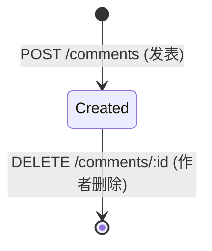

# 评论 (Comment)

用户对快捷指令发表的文字评论，支持用户之间的互动交流。

## 什么是评论？

用户在快捷指令详情页发表文字评论，其他用户可以查看所有评论。评论作者可以删除自己的评论。已下架的快捷指令不允许新增评论。

**关键特征**:
- 评论内容 1-500 字符
- 仅作者本人可删除
- 评论数 `comment_count` 手动维护在 shortcuts 表中
- 已下架（`removed`）的快捷指令仍可查看已有评论但不可新增

## 代码位置

| 方面 | 位置 |
|------|------|
| 数据库表 | `comments` 表 |
| 后端路由 | `backend/src/routes/interact.js` |
| 前端调用 | `frontend/src/api.ts` (`api.getComments`, `api.addComment`, `api.deleteComment`) |
| 前端页面 | `frontend/src/pages/ShortcutDetail.tsx` |

## 结构

```typescript
interface Comment {
  id: number;           // 自增主键
  shortcut_id: number;  // 所属快捷指令 ID
  user_id: number;      // 评论者 ID
  content: string;      // 评论内容（1-500 字符）
  created_at: string;   // 发表时间
}
```

### 关键字段

| 字段 | 类型 | 描述 | 约束 |
|------|------|------|------|
| `content` | `string` | 评论内容 | 必填，1-500 字符 |
| `shortcut_id` | `number` | 所属快捷指令 | 外键，ON DELETE CASCADE |
| `user_id` | `number` | 评论者 | 外键，关联 users 表 |

## 不变量

1. **仅作者可删除**: `DELETE` 操作检查 `user_id` 必须等于当前用户
2. **已下架不可新增**: 快捷指令 `status='removed'` 时禁止新增评论
3. **计数一致性**: `shortcuts.comment_count` 必须等于 `SELECT COUNT(*) FROM comments WHERE shortcut_id=?`

## 生命周期


