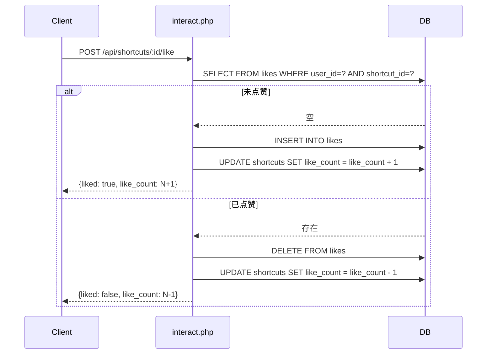
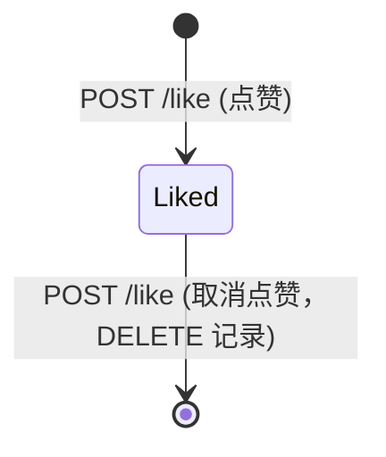

# 点赞 (Like)

点赞是用户对快捷指令表达认可的单向交互，采用 Toggle 模式，同一用户对同一快捷指令只能点赞一次。

## 什么是点赞？

用户点击点赞按钮后，`likes` 表中插入一条记录，同时 `shortcuts` 表的 `like_count` 加 1。再次点击则删除记录并减 1。前端根据 `liked` 字段判断当前用户的点赞状态。

**关键特征**:
- Toggle 模式（点一次赞，再点取消）
- 数据库 UNIQUE 约束保证每人每个快捷指令只能有一条记录
- `like_count` 手动维护而非查询计算

## 代码位置

| 方面 | 位置 |
|------|------|
| 数据库表 | `likes` 表 |
| 后端路由 | `php-shortcut/src/routes/interact.php` (`POST /:id/like`) |
| 前端调用 | `frontend/src/api.ts` (`api.toggleLike`) |

## 结构

```typescript
interface Like {
  id: number;           // 自增主键
  shortcut_id: number;  // 快捷指令 ID (UNIQUE 约束的一部分)
  user_id: number;      // 用户 ID (UNIQUE 约束的一部分)
  created_at: string;   // 点赞时间
}
```

### 不变量

1. **每人每个快捷指令只能点赞一次**: `UNIQUE(shortcut_id, user_id)` 约束保证
2. **计数一致性**: `shortcuts.like_count` 必须等于 `SELECT COUNT(*) FROM likes WHERE shortcut_id=?`

## Toggle 流程



## 生命周期


