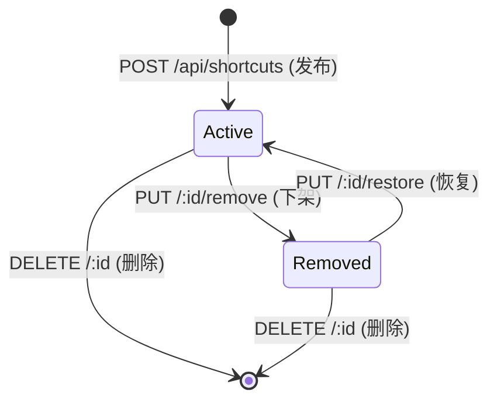
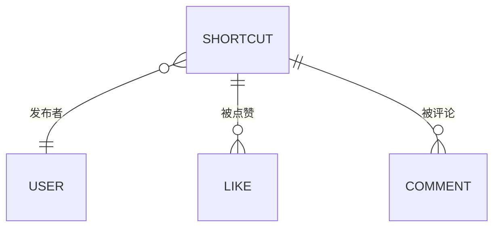

# 快捷指令 (Shortcut)

快捷指令是平台的核心实体，代表用户分享的一个 iOS 快捷指令条目。本质上是 iCloud 快捷指令链接的元数据封装。

## 什么是快捷指令？

一个 Shortcut 包含标题、描述、分类和 iCloud 链接。用户发布后，其他用户可以浏览、点赞、评论，并通过链接在 iOS 设备上下载安装。

**关键特征**:
- 不上传文件到服务器，仅存储 iCloud 链接
- 支持软删除（下架/恢复），不物理删除数据
- 支持按分类筛选、关键词搜索、多种排序方式
- 点赞和评论计数手动维护在 shortcuts 表中

## 代码位置

| 方面 | 位置 |
|------|------|
| 数据库表 | `shortcuts` 表 |
| 后端路由 | `backend/src/routes/shortcut.js` |
| 前端列表 | `frontend/src/pages/Home.tsx` |
| 前端详情 | `frontend/src/pages/ShortcutDetail.tsx` |
| 前端发布 | `frontend/src/pages/Share.tsx` |
| 类型定义 | `frontend/src/pages/types.ts` (`Shortcut` interface) |

## 结构

```typescript
interface Shortcut {
  id: number;              // 自增主键
  title: string;           // 标题
  description: string;     // 描述
  category: string;        // 分类：效率/工具/娱乐/健康/学习/生活/其他
  file_url: string;        // iCloud 快捷指令链接
  file_name: string;       // 文件名（当前未使用）
  file_size: number;       // 文件大小（当前未使用）
  download_count: number;  // 下载次数（访问下载链接时 +1）
  like_count: number;      // 点赞数（手动维护）
  comment_count: number;   // 评论数（手动维护）
  user_id: number;         // 发布者 ID
  username: string;        // 发布者用户名（JOIN 结果）
  avatar: string;          // 发布者头像（JOIN 结果）
  liked: boolean;          // 当前用户是否已点赞（JOIN 结果）
  status: 'active' | 'removed'; // 状态：正常 / 已下架
  created_at: string;      // 发布时间
}
```

### 关键字段

| 字段 | 类型 | 描述 | 约束 |
|------|------|------|------|
| `title` | `string` | 标题 | 必填，创建时需提供 |
| `file_url` | `string` | iCloud 链接 | 必填，需匹配 `icloud.com/shortcuts/...` 格式，去重检查 |
| `category` | `enum` | 分类 | 可选，默认 '其他'，共 7 个分类 |
| `status` | `enum` | 状态 | `active` 或 `removed`，默认 `active` |
| `user_id` | `number` | 作者 | 外键，关联 users 表 |

## 不变量

1. **URL 唯一性**: 同一 iCloud URL 不可被重复发布
2. **下架后评论关闭**: `status='removed'` 的快捷指令不允许新增评论
3. **仅作者可删除**: `DELETE` 操作仅允许作者本人执行（管理员不可删除，但可下架/恢复）
4. **下载计数不递减**: `download_count` 只增不减

## 生命周期



### 状态描述

| 状态 | 描述 | 允许的转换 |
|------|------|-----------|
| `active` | 正常展示，可互动 | → removed（下架）, deleted（删除） |
| `removed` | 已下架，不可评论，作者和管理员可见 | → active（恢复）, deleted（删除） |

## 关系



| 关联概念 | 关系 | 描述 |
|---------|------|------|
| User | 属于 | 每个 Shortcut 属于一个 User（发布者） |
| Like | 包含 | 一个 Shortcut 可有多个 Like |
| Comment | 包含 | 一个 Shortcut 可有多个 Comment |
