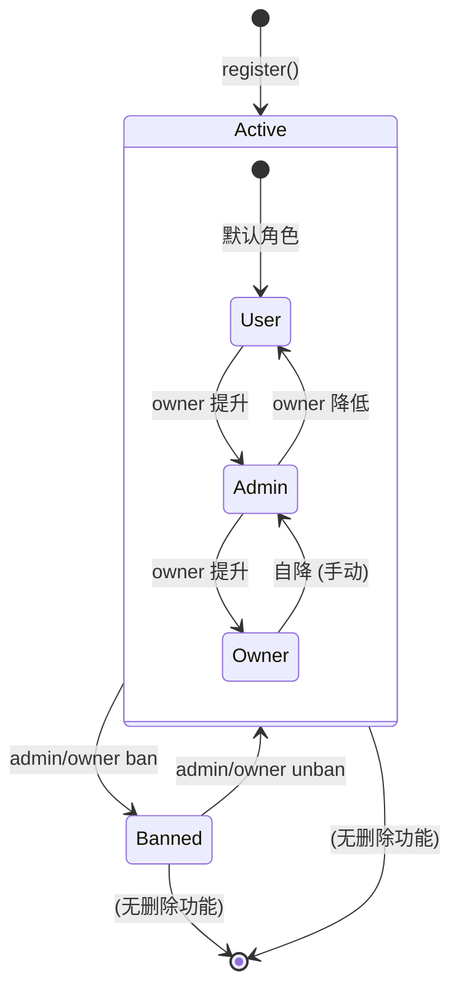
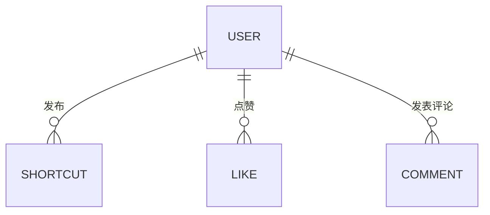

# 用户 (User)

代表平台的注册用户，拥有身份标识、三级角色权限和封禁状态。

## 什么是用户？

每个用户可以发布快捷指令、点赞、评论、编辑个人资料和上传头像。系统采用三级角色体系：站长（`owner`）、管理员（`admin`）、普通用户（`user`）。站长拥有全部权限，管理员可审核/封禁但不能操作其他管理员或站长，普通用户为基础权限。

**关键特征**:
- 密码使用 `password_hash(PASSWORD_BCRYPT)` 哈希存储
- 头像通过 PHP 文件上传到本地文件系统 `uploads/`
- 封禁用户时自动下架其所有活跃快捷指令（`status='removed'`）
- admin 和 owner 角色不可被封禁
- 首次安装用户自动设为 owner
- 登录频率限制：每 IP 15 分钟内最多 5 次尝试

## 代码位置

| 方面 | 位置 |
|------|------|
| 数据库表 | `users` 表 |
| 后端路由 | `php-shortcut/src/routes/users.php` |
| 管理路由 | `php-shortcut/src/routes/admin.php` |
| 认证模块 | `php-shortcut/src/Auth.php` |
| 前端认证 | `frontend/src/AuthContext.tsx` |
| 前端个人主页 | `frontend/src/pages/UserProfile.tsx` |
| 前端管理后台 | `frontend/src/pages/Admin.tsx` + `components/admin/UserManagement.tsx` |
| 安装 | `php-shortcut/public/install.php` |

## 结构

```typescript
interface User {
  id: number;                    // 自增主键
  username: string;              // 用户名（2-20 多字节字符，唯一）
  email: string;                 // 邮箱（唯一）
  password: string;              // bcrypt 哈希
  avatar: string;                // 头像 URL 或空字符串
  bio: string;                   // 个性签名（0-100 字符）
  role: 'user' | 'admin' | 'owner'; // 三级角色
  banned: 0 | 1;                 // 封禁标记
  created_at: string;            // 注册时间
}
```

### 关键字段

| 字段 | 类型 | 描述 | 约束 |
|------|------|------|------|
| `username` | `string` | 用户名 | 唯一，2-20 多字节字符 |
| `email` | `string` | 邮箱 | 唯一，需符合邮箱格式 |
| `password` | `string` | 密码哈希 | `password_hash(PASSWORD_BCRYPT)` |
| `role` | `enum` | 角色 | `user` / `admin` / `owner`，默认 `user` |
| `banned` | `0` 或 `1` | 封禁标记 | 默认 `0`（未封禁） |

## 角色权限矩阵

| 操作 | user | admin | owner |
|------|------|-------|-------|
| 发布快捷指令 | 是 | 是 | 是 |
| 查看仪表盘 | - | 是 | 是 |
| 封禁/解封用户 | - | 是（不可操作 admin/owner） | 是 |
| 审核快捷指令 | - | 是 | 是 |
| 新建用户 | - | - | 是 |
| 变更用户角色 | - | - | 是 |
| 站点设置 | - | - | 是 |
| 系统升级 | - | - | 是 |

## 不变量

1. **管理员不可被封禁**: 封禁操作前检查角色，不可封禁 `admin` 或 `owner` 角色的用户
2. **用户名和邮箱唯一**: 数据库 UNIQUE 约束保证
3. **封禁级联**: 封禁用户时该用户所有 `status='active'` 的快捷指令自动设为 `removed`
4. **角色自保护**: `updateUserRole()` 不允许用户修改自己的角色
5. **首次安装**: `install.php` 创建的第一个用户自动设为 `role='owner'`

## 生命周期



### 状态描述

| 状态 | 描述 | 影响 |
|------|------|------|
| 正常 (`banned=0`) | 可正常使用全部功能 | 登录、发布、点赞、评论 |
| 封禁 (`banned=1`) | 无法登录 | 所有快捷指令同时下架 |

## 关系



| 关联概念 | 关系 | 描述 |
|---------|------|------|
| Shortcut | 发布 | 一个 User 可发布多个快捷指令 |
| Like | 点赞 | 一个 User 可对多个快捷指令点赞 |
| Comment | 评论 | 一个 User 可发表多条评论 |
