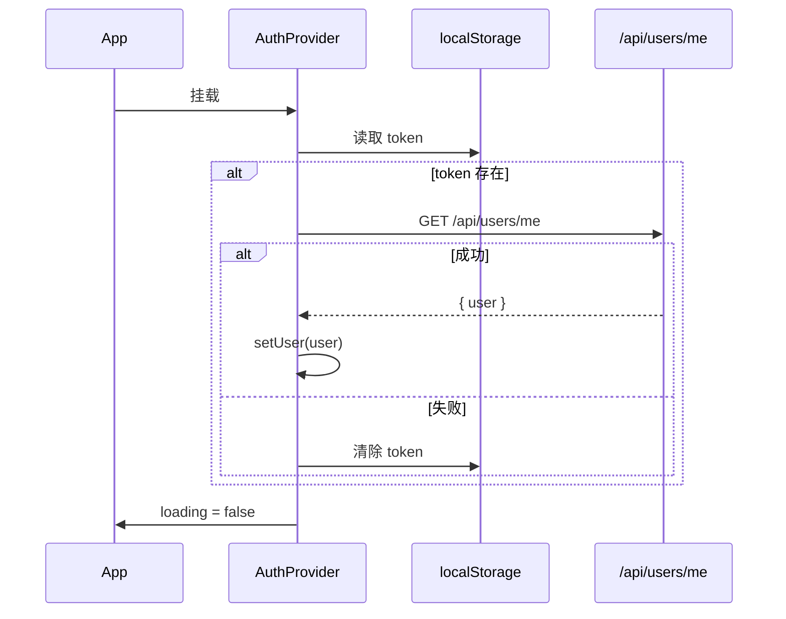

# frontend/src/AuthContext.tsx

前端认证状态管理模块，基于 React Context 提供全局认证能力。

## 导出的接口和 Hook

| 导出 | 类型 | 说明 |
|------|------|------|
| `AuthProvider` | 组件 | 包裹整个应用，提供认证状态 |
| `useAuth()` | Hook | 在任何子组件中获取认证上下文 |

## 状态

| 状态 | 类型 | 说明 |
|------|------|------|
| `user` | `User \| null` | 当前用户信息（id, username, email?, avatar?, role?） |
| `token` | `string \| null` | JWT Token，初始值从 localStorage 读取 |
| `loading` | `boolean` | 初始化加载标记，true 时组件可能显示加载状态 |

## 方法

| 方法 | 签名 | 说明 |
|------|------|------|
| `login` | `(username, password) => Promise<void>` | 调用 API 登录，成功后存储 token 到 localStorage 并设置状态 |
| `register` | `(username, email, password) => Promise<void>` | 调用 API 注册，成功后同 login |
| `logout` | `() => void` | 清除 localStorage token，重置 user 和 token 为 null |
| `updateUser` | `(updates: Partial<User>) => void` | 局部合并更新 user 状态（头像上传/资料修改后同步） |

## 初始化流程



## 使用示例

```tsx
import { useAuth } from '../AuthContext';

function MyComponent() {
  const { user, login, logout } = useAuth();

  if (!user) {
    return <button onClick={() => login('demo', 'password')}>登录</button>;
  }

  return (
    <div>
      <p>欢迎, {user.username}</p>
      <button onClick={logout}>退出</button>
    </div>
  );
}
```

## 依赖

**本模块依赖**:
- `../api.ts` -- `api.login`, `api.register`, `api.getMe`
- `react` -- `createContext`, `useContext`, `useState`, `useEffect`

**依赖本模块的**:
- 所有页面组件 -- 通过 `useAuth()` 获取用户和认证方法
- `Navbar.tsx` -- 显示用户信息和导航
