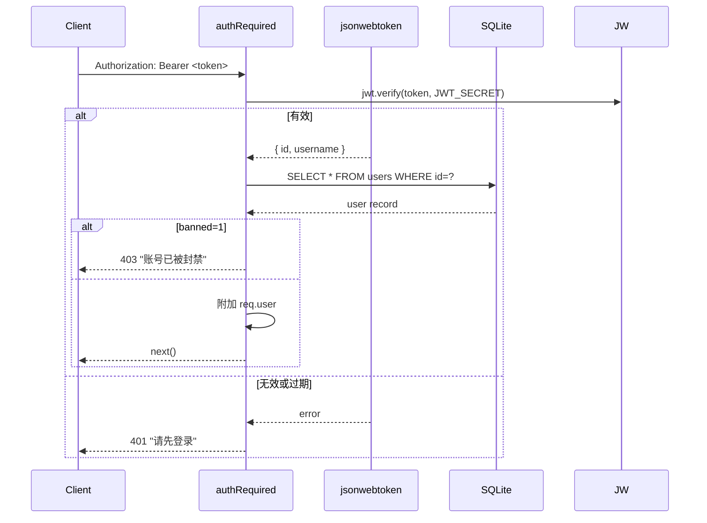

# backend/src/auth.js

JWT 认证中间件模块，提供三个级别的认证控制和 Token 签发。

## 关键文件

| 文件 | 目的 |
|------|------|
| `auth.js` | 单体文件，包含 `generateToken()`, `authRequired`, `authOptional`, `adminRequired` |

## 导出的函数/中间件

| 导出 | 类型 | 说明 |
|------|------|------|
| `generateToken(user)` | 函数 | 签发 JWT（payload: `{id, username}`，有效期 7 天） |
| `authRequired` | 中间件 | 强制认证，校验 Bearer Token，查询用户最新状态（含封禁检查），附加 `req.user` |
| `authOptional` | 中间件 | 可选认证，有 Token 则解析为 `req.user`，没有也放行（`req.user = null`） |
| `adminRequired` | 中间件 | 管理员权限检查，依赖 `authRequired` 先执行，检查 `req.user.role === 'admin'` |

## 认证流程

## 依赖

**本模块依赖**:
- `jsonwebtoken` -- Token 签发和校验
- `./database.js` -- 查询用户最新状态
- `JWT_SECRET` 环境变量 -- 签名密钥

**依赖本模块的**:
- 所有路由文件 -- 使用认证中间件保护端点
- `routes/user.js` -- 登录时使用 `generateToken()` 签发 Token
