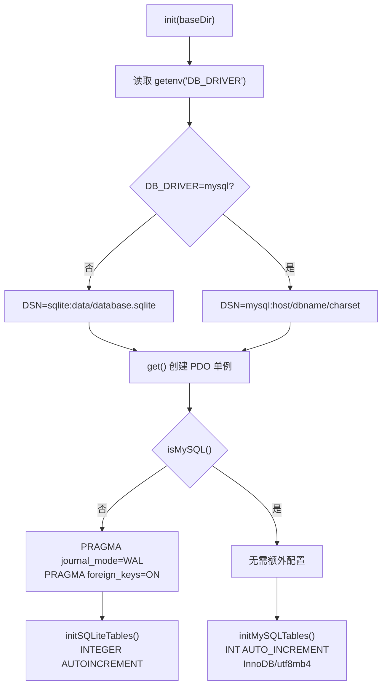

# php-shortcut/src/Database.php

数据库初始化和管理模块，提供 SQLite 和 MySQL 双驱动支持。

## 关键文件

| 文件 | 目的 |
|------|------|
| `Database.php` | 静态单例类，包含数据库连接、Schema 创建、双驱动适配 |

## 数据库配置

- 默认使用 SQLite（零配置，数据文件 `data/database.sqlite`）
- 可选 MySQL（设置 `DB_DRIVER=mysql` 及对应连接参数）
- PDO 配置：`ERRMODE_EXCEPTION`, `FETCH_ASSOC`, `EMULATE_PREPARES=false`
- SQLite 额外启用 WAL 日志模式和 `foreign_keys` 约束
- MySQL 使用 InnoDB 引擎，utf8mb4 字符集

## 导出的方法

| 方法 | 签名 | 说明 |
|------|------|------|
| `init()` | `(string $baseDir): void` | 读取 DB_DRIVER 环境变量，设置 DSN/用户名/密码 |
| `isMySQL()` | `(): bool` | 返回当前驱动是否为 MySQL |
| `get()` | `(): PDO` | 延迟创建 PDO 单例，自动建表和初始化 |

## 初始化流程

## 数据库表

| 表名 | 用途 | 主要字段 | 索引 |
|------|------|---------|------|
| `users` | 用户账号和资料 | id, username(UNIQUE), email(UNIQUE), password, avatar, bio, role(user/admin/owner), banned(0/1), created_at | - |
| `shortcuts` | 快捷指令 | id, slug(UNIQUE), title, description, category, file_url, file_size, download_count, like_count, comment_count, user_id(FK), color, stats(JSON), status(active/pending/removed), created_at | user_id, created_at DESC, slug |
| `likes` | 点赞记录 | id, shortcut_id(FK), user_id(FK), created_at, UNIQUE(shortcut_id, user_id) | shortcut_id, user_id |
| `comments` | 评论内容 | id, shortcut_id(FK), user_id(FK), content, parent_id(FK→comments), created_at | shortcut_id |
| `shortcut_versions` | 版本历史 | id, shortcut_id(FK), url, version_note, created_at | shortcut_id |
| `settings` | 站点设置 | key(PRIMARY), value | - |
| `login_attempts` | 登录频率限制 | ip, attempt_time | - |

## SQLite 与 MySQL 差异

| 场景 | SQLite | MySQL |
|------|--------|-------|
| 主键自增 | `INTEGER PRIMARY KEY AUTOINCREMENT` | `INT AUTO_INCREMENT PRIMARY KEY` |
| 索引创建 | `CREATE INDEX IF NOT EXISTS` | 在 try/catch 中创建（忽略 42000 已存在错误） |
| 冲突更新（settings 表） | `INSERT ... ON CONFLICT(key) DO UPDATE SET` | `INSERT ... ON DUPLICATE KEY UPDATE` |
| 存储引擎 | 文件式 | InnoDB |
| 字符集 | 默认 | utf8mb4 |

## 历史迁移

`install.php` 的 `runMigrations()` 函数通过 `try/catch` 包裹 ALTER TABLE 语句，为旧数据库添加缺失列（如 `stats`, `status`, `color`），保证向前兼容。

## 依赖

**本模块依赖**:
- PDO 扩展（`pdo_sqlite` 或 `pdo_mysql`）
- 环境变量（`DB_DRIVER`, `DB_HOST`, `DB_PORT`, `DB_NAME`, `DB_USER`, `DB_PASS`）

**依赖本模块的**:
- 所有路由文件 -- 通过 `Database::get()` 获取 PDO 实例
- `Auth.php` -- 查询用户最新状态
- `public/index.php` -- 启动时调用 `Database::init()` 和 `Database::get()`
- `public/install.php` -- 安装时初始化数据库
