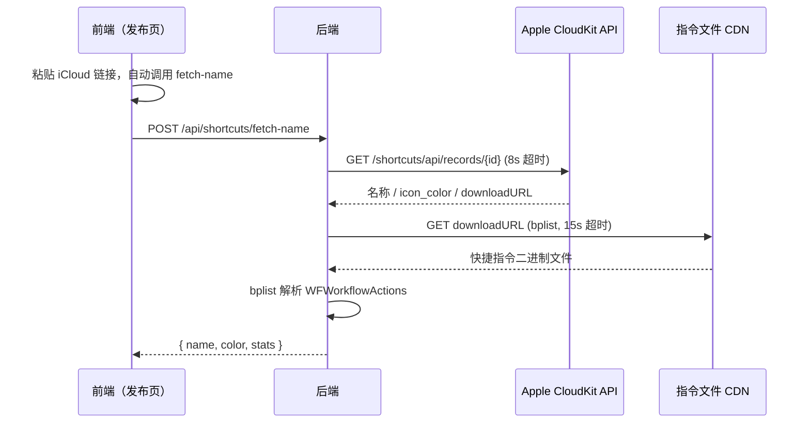

# 捷径社区 - iOS 快捷指令分享社区

一个面向 iOS 用户的快捷指令（Shortcuts）分享社区网站。用户可以注册账号发布自己制作的快捷指令，浏览和下载他人分享的指令，通过点赞和评论进行互动。系统支持版本更新、相似推荐、自适应布局，发布时自动抓取 iCloud 快捷指令的真实名称、图标主题色、操作步骤数、文件大小和访问权限等元数据。

## 技术栈

| 层面 | 技术 |
|------|------|
| 前端 | React 19 + Vite 8 + TypeScript + Tailwind CSS 4 |
| 后端 | Node.js + Express 4 |
| 数据库 | SQLite（通过 better-sqlite3） |
| 认证 | JWT（jsonwebtoken + bcryptjs） |
| 文件上传 | Multer（头像上传） |
| plist 解析 | bplist-parser（快捷指令文件解析） |

## 项目结构

```
├── backend/
│   ├── src/
│   │   ├── index.js           # 服务入口（托管前端 dist + API + SPA fallback）
│   │   ├── database.js        # SQLite 数据库初始化与 Schema
│   │   ├── auth.js            # JWT 认证中间件（authRequired / authOptional / adminRequired）
│   │   └── routes/
│   │       ├── user.js        # 用户注册/登录/资料/密码/头像
│   │       ├── shortcut.js    # 快捷指令 CRUD / 元数据抓取 / plist 解析 / 版本 / 相似推荐
│   │       ├── interact.js    # 点赞 / 评论
│   │       └── admin.js       # 管理员（用户管理/角色管理/分享管理）
│   ├── data/                  # SQLite 数据库文件（自动创建）
│   ├── uploads/               # 头像上传目录（自动创建）
│   └── package.json
└── frontend/
    ├── public/
    │   └── logo.png           # 站点 Logo
    ├── src/
    │   ├── api.ts             # API 请求封装（30+ 个接口）
    │   ├── AuthContext.tsx     # 全局认证状态管理
    │   ├── pages/
    │   │   ├── types.ts           # 共享类型 + CATEGORY_COLORS 主题色
    │   │   ├── Home.tsx           # 首页（自适应网格 / 搜索 / 排序 / 整卡点击跳转）
    │   │   ├── Login.tsx          # 登录页
    │   │   ├── Register.tsx       # 注册页
    │   │   ├── ShortcutDetail.tsx # 详情页（版本记录/评论折叠/相似推荐/统计表格）
    │   │   ├── Share.tsx          # 发布页（自动抓取名称/主题色/注释建议）
    │   │   ├── UserProfile.tsx    # 用户主页（资料/退出/管理入口）
    │   │   └── Admin.tsx          # 管理后台（搜索/新增管理员/角色切换）
    │   └── components/
    │       ├── Navbar.tsx     # 导航栏（搜索/Logo/用户头像）
    │       └── Footer.tsx     # 页脚
    ├── vite.config.ts         # Vite 配置（端口/代理/allowedHosts）
    └── package.json
```

## 环境要求

| 依赖 | 最低版本 | 说明 |
|------|---------|------|
| Node.js | 18+ | 后端运行时 |
| npm | 9+ | 包管理器 |
| pm2 | （可选） | 生产环境进程守护 |
| Git | 2+ | 代码拉取与更新 |

## 快速开始

### 拉取代码

```bash
git clone https://github.com/muzikeji/shortcut.git
cd shortcut
```

### 安装依赖

```bash
# 安装后端依赖
cd backend
npm install

# 安装前端依赖
cd ../frontend
npm install
```

**后端依赖清单**（`backend/package.json`）：

| 包名 | 版本 | 用途 |
|------|------|------|
| `express` | ^4.21.0 | Web 框架 |
| `better-sqlite3` | ^11.0.0 | SQLite 同步驱动 |
| `bcryptjs` | ^2.4.3 | 密码哈希 |
| `jsonwebtoken` | ^9.0.2 | JWT 签发与校验 |
| `cors` | ^2.8.5 | 跨域处理 |
| `multer` | ^2.2.0 | 文件上传（头像） |
| `bplist-parser` | ^0.3.2 | iOS 快捷指令二进制 plist 解析 |

**前端依赖清单**（`frontend/package.json`）：

| 包名 | 版本 | 用途 |
|------|------|------|
| `react` | ^19.2.7 | UI 框架 |
| `react-dom` | ^19.2.7 | React DOM 渲染 |
| `react-router-dom` | ^6.30.4 | 前端路由 |
| `vite` | ^8.1.1 | 构建工具 |
| `typescript` | ~6.0.2 | 类型检查 |
| `tailwindcss` | ^4.3.3 | 样式框架 |
| `@tailwindcss/vite` | ^4.3.3 | Tailwind Vite 插件 |
| `@vitejs/plugin-react` | ^6.0.3 | Vite React 插件 |
| `oxlint` | ^1.71.0 | 代码检查 |

### 启动开发服务器

后端（默认端口 3001）：

```bash
cd backend
npm run dev
```

前端（默认端口 5173）：

```bash
cd frontend
npm run dev
```

前端 Vite 已配置反向代理，`/api` 和 `/uploads` 请求自动转发到后端 `http://localhost:3001`。开发时只需访问 `http://localhost:5173`。

### 生产部署

```bash
# 1. 拉取最新代码
cd ~/shortcut
git pull

# 2. 安装/更新后端依赖（新增依赖需要此步骤）
cd backend
npm install

# 3. 构建前端（含 TypeScript 类型检查）
cd ../frontend
npm run build

# 4. 重启后端服务（自动托管前端 dist/ + SPA 路由）
cd ../backend
pm2 restart shortcut
```

> **首次部署设置管理员**：首次启动后数据库中尚无管理员，需手动设置：
>
> ```bash
> cd ~/shortcut/backend
> node -e "
> const { getDb } = require('./src/database');
> const db = getDb();
> db.prepare(\"UPDATE users SET role = 'admin' WHERE username = '你的用户名'\").run();
> console.log('已设为管理员');
> "
> ```

**首次部署时安装 pm2 并配置常驻**：

```bash
npm install -g pm2
cd ~/shortcut/backend
pm2 start src/index.js --name shortcut
pm2 save
pm2 startup
```

## 程序更新流程

生产服务器 (`192.168.0.108`) 更新步骤：

```bash
# 1. 拉取最新代码
cd ~/shortcut && git pull

# 2. 检查后端是否有新增依赖（查看 commit 日志中是否涉及 package.json 变更）
# 若有新增依赖务必执行：
cd ~/shortcut/backend && npm install

# 3. 重新构建前端
cd ~/shortcut/frontend && npm run build

# 4. 重启后端
cd ~/shortcut/backend && pm2 restart shortcut

# 5. 验证服务
curl -s http://localhost:3001/api/shortcuts?limit=1 | head -c 200
```

> **重要提醒**：
> - 前后端都有依赖变更时，必须分别在两个目录执行 `npm install`
> - 前端构建包含 `tsc -b` 类型检查，任何未使用的变量/导入（TS6133）都会导致构建失败
> - 若 pm2 进程未启动，先查看日志：`pm2 logs shortcut --lines 30`
> - 数据库迁移（新增列）在 `database.js` 中自动完成，首次启动时执行

## 功能总览

### 权限矩阵

| 功能 | 游客 | 用户 | 管理员 |
|------|:--:|:--:|:--:|
| 浏览/搜索快捷指令 | ✓ | ✓ | ✓ |
| 按最新/最热/下载量排序 | ✓ | ✓ | ✓ |
| 下载快捷指令 | ✓ | ✓ | ✓ |
| 查看评论 | ✓ | ✓ | ✓ |
| 查看操作步骤/大小/权限等统计 | ✓ | ✓ | ✓ |
| 注册/登录 | ✓ | - | - |
| 发布新快捷指令（自动抓取元数据） | - | ✓ | ✓ |
| 点赞/取消点赞 | - | ✓ | ✓ |
| 发表/删除评论 | - | ✓ | ✓ |
| 修改个人资料/密码 | - | ✓ | ✓ |
| 上传头像 | - | ✓ | ✓ |
| 编辑自己的快捷指令 | - | ✓ | ✓ |
| 更新快捷指令版本 | - | ✓ | ✓ |
| 下架/恢复自己的分享 | - | ✓ | ✓ |
| 进入管理后台 | - | - | ✓ |
| 封禁/解封用户 | - | - | ✓ |
| 下架/恢复任意分享 | - | - | ✓ |
| 新增管理员账号 | - | - | ✓ |
| 设置/取消用户管理员角色 | - | - | ✓ |
| 搜索用户和快捷指令 | - | - | ✓ |

### 特色功能

- **发布页注释建议**：发布页顶部提供可复制的注释内容（发布者 / 来源 / 发布时间 / 作品地址），一键复制供粘贴到快捷指令的「注释」动作中
- **10 位时间戳 slug**：进入发布页即生成 `Math.floor(Date.now()/1000)` 的固定标识，作品地址 `{origin}/shortcut/{slug}` 永久不变
- **自动抓取真实名称与主题色**：粘贴 iCloud 链接后自动调用 CloudKit API 获取快捷指令真实名称和图标颜色，卡片和详情页按主题色渲染
- **统计信息展示**：发布时解析快捷指令文件（bplist），在详情页以纵向表格展示操作步骤数、文件大小、最低系统版本、动作种类数、访问权限（带图标）、导入问题数
- **整卡可点击**：首页和用户主页的快捷指令卡片整块可点击跳转到详情页，内部点赞/下载等按钮互不干扰
- **版本更新**：发布者可提交新的 iCloud 链接更新快捷指令，浏览者可查看版本历史
- **相似推荐**：详情页根据分类自动推荐 5 条相似快捷指令，大屏右侧展示、小屏下方展示
- **评论折叠**：第 5 条评论后自动折叠，点击展开查看全部
- **自适应布局**：首页 / 个人主页使用 CSS Grid auto-fill，从手机到超宽屏自适应列数
- **管理搜索**：管理后台支持按用户名 / 邮箱搜索用户，按标题 / 作者搜索分享

## API 接口

### 用户认证

| 方法 | 路径 | 说明 | 认证 |
|------|------|------|:--:|
| POST | `/api/users/register` | 注册 | - |
| POST | `/api/users/login` | 登录 | - |
| GET | `/api/users/me` | 获取当前用户信息 | ✓ |
| GET | `/api/users/:id` | 获取用户公开信息 | - |
| PUT | `/api/users/profile` | 修改资料（用户名/邮箱/签名） | ✓ |
| PUT | `/api/users/password` | 修改密码 | ✓ |
| POST | `/api/users/avatar` | 上传头像（multipart, 2MB） | ✓ |

### 快捷指令

| 方法 | 路径 | 说明 | 认证 |
|------|------|------|:--:|
| GET | `/api/shortcuts` | 列表（`?search=&sort=&page=&userId=`） | - |
| GET | `/api/shortcuts/:id` | 详情（支持数字 ID 或时间戳 slug） | - |
| POST | `/api/shortcuts/fetch-name` | 预取快捷指令名称/颜色/统计 | - |
| POST | `/api/shortcuts` | 发布（iCloud 链接，可选 slug/color） | ✓ |
| PUT | `/api/shortcuts/:id` | 编辑（标题/描述/分类） | ✓ |
| DELETE | `/api/shortcuts/:id` | 删除（仅限作者） | ✓ |
| PUT | `/api/shortcuts/:id/remove` | 下架（作者或管理员） | ✓ |
| PUT | `/api/shortcuts/:id/restore` | 恢复上架（作者或管理员） | ✓ |
| GET | `/api/shortcuts/:id/download` | 下载/跳转（计数+1 后 302） | - |
| GET | `/api/shortcuts/:id/versions` | 版本历史列表 | - |
| POST | `/api/shortcuts/:id/versions` | 更新版本（新 iCloud 链接） | ✓ |
| GET | `/api/shortcuts/:id/similar` | 相似推荐（同分类 Top 5） | - |

### 互动

| 方法 | 路径 | 说明 | 认证 |
|------|------|------|:--:|
| POST | `/api/shortcuts/:id/like` | 切换点赞（Toggle） | ✓ |
| GET | `/api/shortcuts/:id/comments` | 评论列表 | - |
| POST | `/api/shortcuts/:id/comments` | 发表评论 | ✓ |
| DELETE | `/api/shortcuts/:id/comments/:commentId` | 删除评论（仅本人） | ✓ |

### 管理员

| 方法 | 路径 | 说明 | 认证 |
|------|------|------|:--:|
| GET | `/api/admin/users` | 用户列表（`?search=&page=`） | 管理员 |
| POST | `/api/admin/users` | 新增管理员账号 | 管理员 |
| PUT | `/api/admin/users/:id/role` | 设置用户角色 | 管理员 |
| PUT | `/api/admin/users/:id/ban` | 封禁用户（同时下架其所有分享） | 管理员 |
| PUT | `/api/admin/users/:id/unban` | 解封用户 | 管理员 |
| GET | `/api/admin/shortcuts` | 分享列表（`?status=&search=&page=`） | 管理员 |

## 元数据抓取机制

发布快捷指令时，后端通过以下流程自动获取元数据：



**抓取的数据项**：

| 数据 | 来源 | 示例 |
|------|------|------|
| 快捷指令名称 | `fields.name.value` | 安心记加班非月底结算版 |
| 图标主题色 | `fields.icon_color.value`（0xRRGGBBAA） | `#3871DE` |
| 操作步骤数 | `WFWorkflowActions.length` | 134 步 |
| 文件大小 | 下载的 plist 文件字节数 | 618.8 KB |
| 最低系统版本 | `WFWorkflowMinimumSystemVersion` | iOS 17.0 |
| 动作种类数 | `WFWorkflowActionIdentifier` 去重 | 42 种 |
| 访问权限 | 动作标识 → 权限标签映射 | 照片、文件、通知 |
| 导入问题数 | `WFWorkflowImportQuestions.length` | 3 个 |

## 环境变量

| 变量 | 说明 | 默认值 |
|------|------|--------|
| `PORT` | 后端服务端口 | `3001` |
| `JWT_SECRET` | JWT 签名密钥 | 内置默认值（生产务必更换） |

生产环境建议：

```bash
export JWT_SECRET="$(openssl rand -hex 32)"
```

## 数据库

项目使用 SQLite 单文件数据库 `backend/data/shortcuts.db`，包含以下表：

| 表 | 字段 | 说明 |
|------|------|------|
| `users` | id / username / email / password / avatar / bio / role / banned | 用户 |
| `shortcuts` | id / **slug** / title / description / category / file_url / **color** / **stats** / file_size / download_count / like_count / comment_count / status / user_id | 快捷指令 |
| `shortcut_versions` | id / shortcut_id / url / version_note / created_at | 版本历史 |
| `likes` | id / shortcut_id / user_id（UNIQUE 约束） | 点赞 |
| `comments` | id / shortcut_id / user_id / content | 评论 |

数据库文件在首次启动时自动创建，表结构和索引通过 `database.js` 中的 `initTables()` 自动初始化。新增列通过 `ALTER TABLE ... ADD COLUMN` 迁移（`try/catch` 包裹保证幂等）。

## Vite 配置说明

`frontend/vite.config.ts` 中配置了以下内容：

```typescript
server: {
  port: 5173,
  allowedHosts: ['.monkeycode-ai.online'],
  proxy: {
    '/api':     { target: 'http://localhost:3001', changeOrigin: true },
    '/uploads': { target: 'http://localhost:3001', changeOrigin: true },
  },
}
```

- 开发时前端请求 `/api/xxx` 转发到后端 `localhost:3001`
- 生产环境由后端 Express 直接托管前端 `dist/` 并处理 SPA 路由

## 最新更新

### v1.5.0 - 快捷指令元数据抓取与展示

- 发布时自动抓取 iCloud 快捷指令的真实名称、图标主题色
- 详情页展示纵向统计表格：操作步骤 / 文件大小 / 最低系统 / 动作种类 / 访问权限 / 导入问题
- 10 位秒级时间戳 slug，进入发布页即生成，作品地址永久不变
- 首页和个人主页整张卡片可点击跳转详情
- 发布页注释建议卡片（发布者 / 来源 / 发布时间 / 作品地址），一键复制

### v1.4.0 - 版本更新与相似推荐

- 版本历史记录，支持更新快捷指令的 iCloud 链接
- 详情页根据分类自动推荐相似快捷指令

### v1.3.0 - 分类主题色与评论折叠

- 快捷指令卡片和详情页根据分类自动着色
- 评论超过 5 条自动折叠，可展开/收起

### v1.2.0 - 管理后台

- 管理员搜索用户和快捷指令
- 封禁 / 解封用户（级联下架分享）
- 新增管理员账号、设置 / 取消管理员角色

### v1.1.0 - 自适应网格布局

- CSS Grid auto-fill 响应式布局
- 移动端到超宽屏自动适配列数

## 页面截图

> 以下为各页面的代表性功能展示。截图可能因浏览器和屏幕尺寸不同而略有差异。

### PC 端

(请在部署后截图补充此处)

- 首页 - 快捷指令网格列表
- 详情页 - 统计表格与评论区
- 发布页 - 注释建议卡片与自动识别
- 用户主页 - 资料编辑与快捷指令管理
- 管理后台 - 用户搜索与角色管理

### 手机端

(请在部署后截图补充此处)

- 首页 - 自适应单列布局
- 详情页 - 纵向信息展示
- 发布页 - 移动端表单适配

## 项目文档

完整的技术文档位于 `.monkeycode/docs/`：

| 文档 | 说明 |
|------|------|
| INDEX.md | 文档索引入口 |
| ARCHITECTURE.md | 系统架构设计 |
| INTERFACES.md | 全部 API 接口规范 |
| DEVELOPER_GUIDE.md | 开发者指南（环境/部署/常见任务） |
| 专有概念/ | 核心领域概念详解 |
| 模块/ | 各模块 README |

## License

MIT
